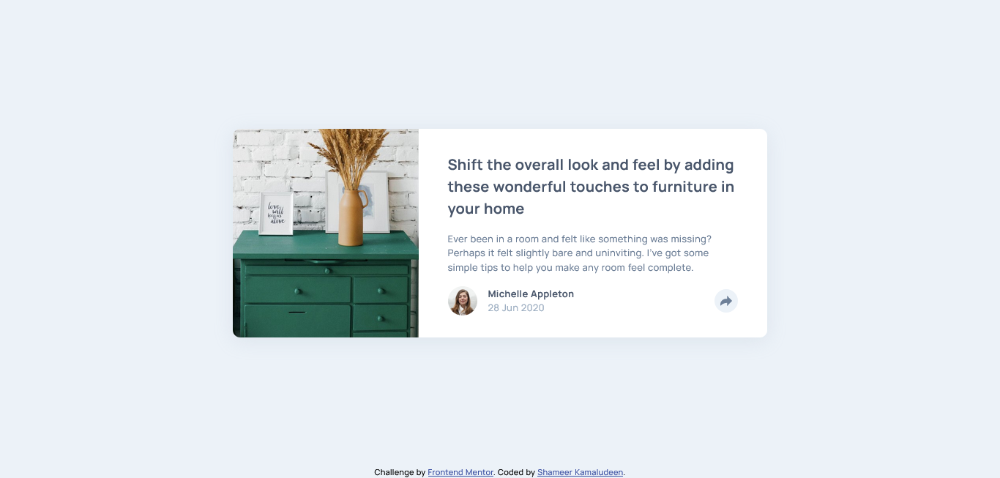

# Frontend Mentor - Article preview component solution

This is a solution to the [Article preview component challenge on Frontend Mentor](https://www.frontendmentor.io/challenges/article-preview-component-dYBN_pYFT). Frontend Mentor challenges help you improve your coding skills by building realistic projects. 

## Table of contents

- [Overview](#overview)
  - [The challenge](#the-challenge)
  - [Screenshot](#screenshot)
  - [Links](#links)
- [My process](#my-process)
  - [Built with](#built-with)
  - [What I learned](#what-i-learned)
  - [Continued development](#continued-development)
  - [Useful resources](#useful-resources)
- [Author](#author)
- [Acknowledgments](#acknowledgments)

## Overview

With the help of the challenge was able to learn several things like a speech bubble, familiarised some javascript and many more. The main learning point here is I keep improving the front end, finding what is possible and not possible with all these technologies.

### The challenge

Users should be able to:

- View the optimal layout for the component depending on their device's screen size
- See the social media share links when they click the share icon

### Screenshot

### Links

- Solution URL: [Click here](https://github.com/shameerkamaludeen/article-preview-component)
- Live Site URL: [Click here](https://shameerkamaludeen.github.io/article-preview-component/)

## My process

### Built with

- Semantic HTML5 markup
- Flexbox
- Mobile-first workflow

### What I learned

- Started familiarising with javascript
- learned how to do a speech bubble
- positioning elements

### Continued development

I want to be clear when choosing the structure of the document more, what actually happens is placing elements wrongly cause some of the designing not possible and that makes rewriting CSS as well as HTML which ends up in hefty time to finish the project, that needs to be changed. It's obvious to determine what elements to choose and place where when seeing the design itself. 

### Useful resources

- [Speech bubble with arrow](https://stackoverflow.com/q/30299093/3877538)

## Author

- Github - [Shameer Kamaludeen](https://github.com/shameerkamaludeen)
- Frontend Mentor - [@shameerkamaludeen](https://www.frontendmentor.io/profile/shameerkamaludeen)
- Twitter - [@ShameerKamalud1](https://twitter.com/ShameerKamalud1)

## Acknowledgments

Stuck in with the Frontend Mentor helps me learn quickly and diversify areas of learning frontend design.